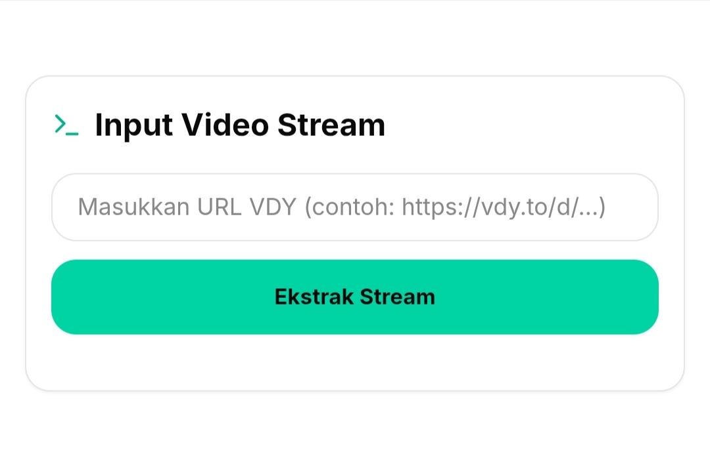

<div align="center">

# Vidoy Downloader

Modern, fast, and reliable video downloader built with Next.js 15.
Extract video metadata, analyze HLS/CDN streams, and download media through a clean, responsive interface.

---


</div>

---

## Overview
Vidoy Downloader adalah aplikasi web modern untuk menganalisis, mengekstraksi, dan mengunduh video dari **vdy.to** menggunakan antarmuka yang cepat, bersih, dan responsif.

Project ini dibangun dengan **Next.js App Router**, **React 19**, dan **Tailwind CSS v4**, serta mendukung ekstraksi **Direct MP4** maupun **HLS (.m3u8)**.

---

## Features

- 🎥 Analisis URL video
- 📦 Metadata Extraction
- ⚡ Direct MP4 Download
- 📺 HLS (.m3u8) Support
- 📈 Real-time Download Progress
- 📂 Download History
- 🌙 Dark Mode
- 📱 Fully Responsive
- 🎨 Modern UI
- 🔒 Secure API Routes

---

## Preview

<p align="center">
  
  
</p>

---

## Tech Stack

| Technology | Version |
|------------|----------|
| Next.js | 15 |
| React | 19 |
| TypeScript | Latest |
| Tailwind CSS | v4 |
| Framer Motion | Latest |
| Lucide React | Latest |
| FFmpeg | Required |

---

## Project Structure

```text
app/
components/
hooks/
lib/
utils/
downloads/
history/
middleware.ts
```

---

## Installation

```bash
git clone https://github.com/s-fajar15/streamvidoy.git
cd streamvidoy
npm install
npm run dev
```

---

## Requirements

- Node.js 18+
- FFmpeg
- FFprobe

Android (Termux)

```bash
pkg install ffmpeg
---

## License

MIT License

---
